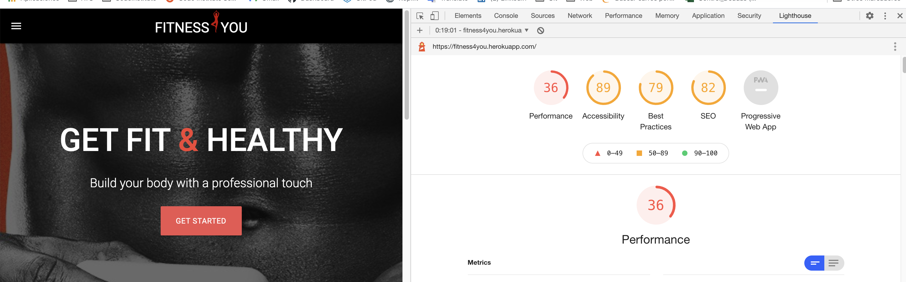
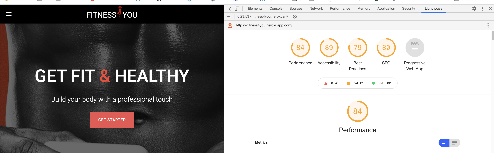
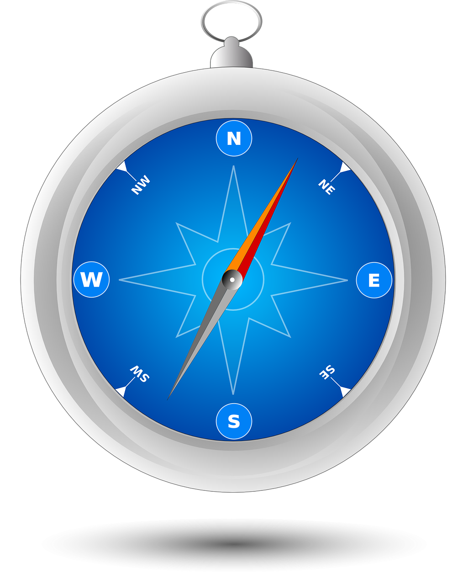
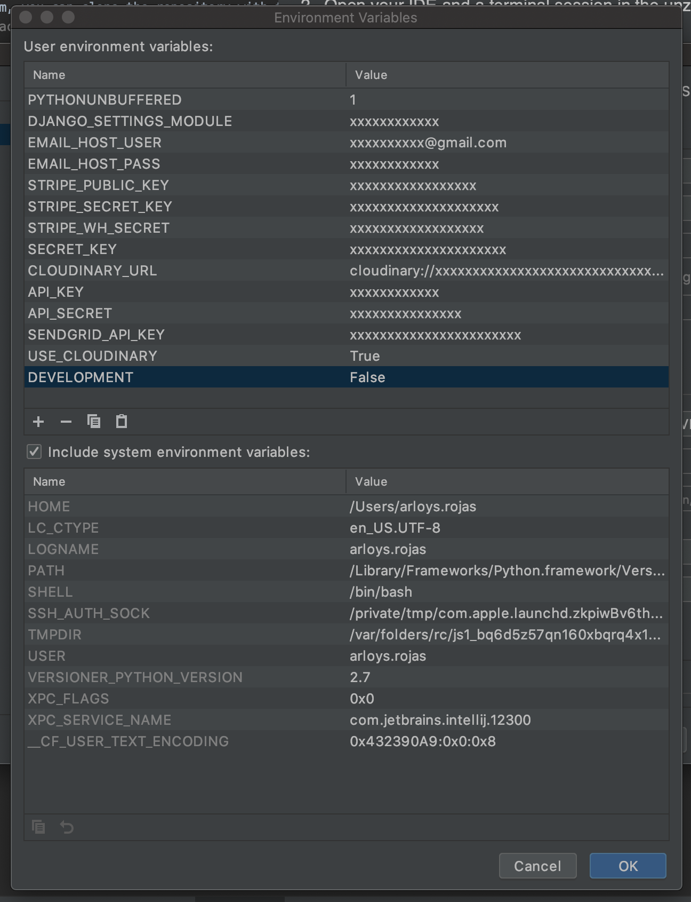
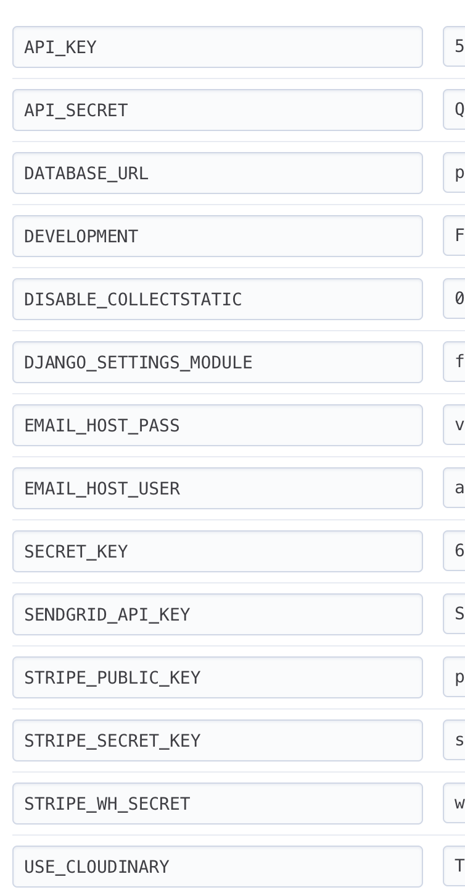

# Fitness4You: An E-commerce site
This e-commerce site is was created as a Full-Stack Mile stone project with Code Institute.
It is a web-based store where users can view and purchase fitness and nutritional supplements as a part of their fitness routine. They can search and filter the offered products dynamically Users can interact with the site as a guest, including purchasing or users can create a profile, log in and interact with the site through his or her own account. This also allows the user to keep track of his or her information and purchase history.
[Open app](https://fitness4you.herokuapp.com/)

## Table of Contents
- [Demo](#demo)
- [Planning Fitness4You](#planning-fitness4you)
- [Features](#features)
  * [Existing Features](#existing-features)
    + [Navbar](#navbar)
    + [Home Page](#home-page)
    + [Product List](#product-list)
      - [Product details:](#product-details-)
      - [Buttons:](#buttons-)
    + [Product Page](#product-page)
      - [Product details:](#product-details--1)
      - [Buttons:](#buttons--1)
    + [Register Page](#register-page)
    + [Login Page](#login-page)
    + [Logout Page](#logout-page)
    + [Admin Page](#admin-page)
    + [Cart Page](#cart-page)
    + [Checkout Page](#checkout-page)
    + [Checkout Successful Page](#checkout-successful-page)
  * [Features Left to Implement](#features-left-to-implement)
- [Languages and Technologies](#languages-and-technologies)
  * [Languages](#languages)
  * [Technologies](#technologies)
- [Model:](#model-)
  * [Database Schema](#database-schema)
- [Main problems and their solutions](#main-problems-and-their-solutions)
- [Testing](#testing)
  * [Unit tests](#unit-tests)
    + [Python Validation](#python-validation)
    + [HTML Validation](#html-validation)
    + [CSS Validation](#css-validation)
    + [JavaScrip Validation](#javascrip-validation)
  * [Functional tests](#functional-tests)
  * [Lighthouse test](#lighthouse-test)
    + [Before:](#before-)
    + [After:](#after-)
- [Browser Compatibility test](#browser-compatibility-test)
- [Deployment](#deployment)
  * [How to run this project locally](#how-to-run-this-project-locally)
    + [Installed:](#installed-)
    + [Accounts in:](#accounts-in-)
    + [Instructions:](#instructions-)
  * [Deploy to heroku](#deploy-to-heroku)
- [Credits](#credits)

## Demo

## Planning Fitness4You
The planning done prior to developing the project can be found in the document below:

[Project Planning document](https://github.com/ArloysMacias/fitness4you/blob/master/PLANNING.md)

## Features

### Existing Features

#### Navbar
Each page on the site has the navbar accessible on the very top of the page. In mobile devices it turns into a hamburger menu in the top left corner of the page.

* The following options are presented on the navbar when the user is not logged in:
    * Home
    * Products
    * Account (Dropdown: Login / Register)
    * Shopping cart (with number indicating items inside)

* The following options are presented on the navbar when the user is logged in:
    * Home
    * Products
    * Account (Dropdown: My profile / Logout)
    * User name
    * Shopping cart (with number indicating items inside)

* The following options are presented on the navbar when a superuser is logged in:
    * Home
    * Products
    * Management (Dropdown: Edit product / Add product)
    * Account (Dropdown: My profile / Logout)
    * User name
    * Shopping cart (with number indication items inside)

#### Home Page
Created with the intent on drawing the interest of the user with bold colors and intriguing images. 

* Buttons that makes it easy for the user to create an account, as it directs him or her to the Login/Register page
* A section showing some of the products available for purchase, with clickable links taking the user to the specific product page
* Footer with contact information to the owner of the site

#### Product List
##### Product details: 
* Displayed in the product cards are information about each product such as name, brand, price, rating and description. Each product also displays an image which is clickable for an enlarged view.

##### Buttons:
* Each product card has a 'view' button and a 'add-to-cart' button attach to it. Clicking the 'view' button will redirect the user to the specific product page and the 'add-to-cart' button will place the product in the cart, showing a success message when completed.

#### Product Page
##### Product details:
* As opposed to the Product list, the Product page displays information about a specific product in a larger view such as name, brand, price, rating and description. Each product also displays an image which is clickable for an enlarged view.

##### Buttons:
* An 'add-to-cart' button will place the product in the cart, showing a success message when completed and a 'continue shopping' button will take the user back to the Product List.

#### Register Page
This template is from django's inbuilt allauth.

* The register page allows new users to be added to the database. This consists of a registration form where the user enters the information needed in order to successfully register as a user on the page. When the user clicks 'Sign up' a new user is added into the database and a successful registration message is shown. 

#### Login Page
* When the user clicks the 'login' button they are redirected to the login page where they have to input user name and password in order to successfully log in. If an incorrect user name or password is entered the page is refreshed, the user is informed and asked to submit again. After successful login the user is redirected to 'Home' page.

#### Logout Page
* When the user clicks on the 'logout' button they are redirected to a confirmation page where the user is asked to confirm if they want to complete the log out. Once logged out the user will be redirected to the 'Home' page.

#### Admin Page
* The admin page gives the superuser the option of modifying the products, delete and add new. In the 'Product list' the superuser can view individual products, delete, or modify them with the click of a button. The super user also has an added 'Management' option in the navbar where they can choose 'Add product' or 'Edit product' which takes the superuser to a form where all products can be accessed. 

#### Cart Page
* The Cart page displays the shopping cart with the items the user had added previously. It shows the product quantity, individual price, total price and product description. It also allows the user to change the quantity of individual products as well as deleting a product from the cart. If the quantity of an item is reduced to zero it will automatically be removed from the cart. Buttons to continue shopping or to proceed to checkout are displayed. If the user visits their cart but hasn't added any products, they will be informed that their cart is empty and no checkout button will be visible.

#### Checkout Page
* The checkout page contains the forms used to insert the user's personal details and to insert payment details. At the bottom of the page is the 'Submit payment' button which will initiate interaction with Stripe API.

#### Checkout Successful Page
* If checkout is successful the user will be redirected to the 'Checkout Successful Page' where they will be informed that the payment went through and a confirmation email has been sent to the email provided in the previous form. The user will also see a "receipt" or a complete list showing the order they just placed.

### Features Left to Implement
Without time constraints it would be ideal to make it a bigger project with gym affiliations and facilities. As shown in the original wireframes, this was the idea from the start.
To achieve this the following features would need to be implemented:

* A choice of different training options and classes, both in groups and with a PT
* The option to sign up for a gym membership
* The option for users to leave product reviews

[Back to Top](#table-of-contents)
## Languages and Technologies

### Languages
* [HTML5](https://html.spec.whatwg.org/multipage/)
    * A markup language that it is used for structuring and presenting content. 
* [CSS](https://www.w3.org/Style/CSS/)
    * The language for describing the presentation of Web pages. The project uses it for including colors, layout, and fonts.
* JavaScript
    * Used to make web development easier and more attractive.
* [Python3](https://www.python.org/download/releases/3.0/)
    * an interpreted, high-level and general-purpose programming language.
* [JQuery](https://jquery.com/)
    * Is a JavaScript library designed to simplify HTML DOM tree traversal and manipulation
 
### Technologies
* [Heroku](https://www.heroku.com/)
    * Is a cloud platform as a service (PaaS) supporting several programming languages (Java, Node.js, Scala, Clojure, Python, PHP, and Go).
* [Cloudinary](https://pypi.org/project/cloudinary/)
    * Is a cloud service that offers a solution to a web application’s entire image management pipeline.
      Users can easily upload images to the cloud and automatically perform smart image resizing, cropping and conversion without installing any complex software
* [Whitenoise](https://pypi.org/project/whitenoise/)
    * Allows your web app to serve its own static files, making it a self-contained unit that can be deployed anywhere without relying on nginx, Amazon S3 or any other external service
* [Materialize (0.100.2)](http://archives.materializecss.com/0.100.2/)
    * Materialize is a modern responsive CSS framework based on Material Design by Google.
* [noUislider](https://refreshless.com/nouislider/)
    * NoUiSlider is a lightweight range slider with multi-touch support and a ton of features. It supports non-linear ranges, requires no external dependencies, has keyboard support, and it works great in responsive designs
* [Wnumb](https://refreshless.com/wnumb/)
    * WNumb is a formatting library with a dead-simple interface. It has two methods: to and from. Licensed MIT, so free for personal and commercial use.
* [Django-Crispy-Forms](https://django-crispy-forms.readthedocs.io/en/latest/index.html)
    * Is a pluggable Django app that helps to write DRY forms by providing additional capability to configure and control the rendered HTML.
* [Gunicorn](https://en.wikipedia.org/wiki/Gunicorn) 
    * Green Unicorn is a Python Web Server Gateway Interface (WSGI) HTTP server. It is a pre-fork worker model, ported from Ruby's Unicorn project. The Gunicorn server is broadly compatible with a number of web frameworks, simply implemented, light on server resources and fairly fast.
* [Pillow](https://en.wikipedia.org/wiki/Python_Imaging_Library)
    * Python Imaging Library (abbreviated as PIL) (in newer versions known as Pillow) is a free and open-source additional library for the Python programming language that adds support for opening, manipulating, and saving many different image file formats
* [Requests](https://www.django-rest-framework.org/api-guide/requests/)
    * REST framework's Request class extends the standard HttpRequest, adding support for REST framework's flexible request parsing and request authentication.
* [Stripe](https://stripe.com/es-se)
    * Payment processing software and application programming interfaces (APIs) for e-commerce websites and mobile applications.
* [Django-filter](https://django-filter.readthedocs.io/en/stable/)
    * Django-filter is a generic, reusable application to alleviate writing some of the more mundane bits of view code. Specifically, it allows users to filter down a queryset based on a model’s fields, displaying the form to let them do this.

[Back to Top](#table-of-contents)
## Model:

### Database Schema

[Back to Top](#table-of-contents)
## Main problems and their solutions

| No | Name                                                            | Description                                                                                                                                                                                                                                                           | Solutions                                                                                                                                                                                                                                                                                                                                                                                                                                                                                                                                                                                     |
|----|-----------------------------------------------------------------|-----------------------------------------------------------------------------------------------------------------------------------------------------------------------------------------------------------------------------------------------------------------------|-----------------------------------------------------------------------------------------------------------------------------------------------------------------------------------------------------------------------------------------------------------------------------------------------------------------------------------------------------------------------------------------------------------------------------------------------------------------------------------------------------------------------------------------------------------------------------------------------|
| 1  | Loading files                                                   | Files in the media folder do not load properly                                                                                                                                                                                                                        | I included the following line of code in the setting.py file   ...  ...  ...   ...  'django.contrib.messages.context_processors.messages',  'django.template.context_processors.media', ],  ‘django.template.context_processors.media’,  in your settings.py  ... ... ...                                                                                                                                                                                                                                                                                                                     |
| 2  | I can't login to the admin section                              |                                                                                                                                                                                                                                                                       | I deleted the 3 points in the following line of code       space             ... ... ... ... AUTHENTICATION_BACKENDS = [ # Needed to login by username in Django admin, regardless of   allauth  'django.contrib.auth.backends.ModelBackend', # `allauth` specific authentication methods, such as login by e-mail 'allauth.account.auth_backends.AuthenticationBackend', ... ... ... ]                                                                                                                                                                                                       |
| 3  | Link in materializecss checkboxes                               | I couldn't figure out how to capture the event (onchange or onclick) in a materializecss checkbox and send the url to the view                                                                                                                                        | I changed the element and decided to develop the filters with a collapsible accordion from [materializecss](https://materializecss.com/collapsible.html)  and with radio buttons                                                                                                                                                                                                                                                                                                                                                                                                                                                                                            |
| 4  | Webhook not working                                             | When doing the webhook, because I am using intellij idea (and I am working locally) I am not able to obtain the address of the webhook to pass it to stripe                                                                                                           | I look for a tool that allows me to expose a my local development server to the Internet https://www.pubnub.com/learn/glossary/what-is-ngrok/ ngrok https://ngrok.com/  1. The setting.py allowed the address provided by Ngrok: ALLOWED_HOSTS = ['2a0d946fed40.ngrok.io'] 2. Copy the address in Stripe / Webhooks / Webhooks Data: http://2a0d946fed40.ngrok.io/checkout/wh/ 3. Write the Stripe WebHooks key for the local development environment: STRIPE_WH_SECRET = 'xxxxxxxxxxxxxxxxxxxxxxxxxxx'.  (Should not be in environment STRIPE_WH_SECRET = os.getenv('STRIPE_WH_SECRET', '')) |
| 5  | Pagination and drop-down from materialize cancel each other out | When I enter this jquery version:  The pagination works but the drop-down from materialize does not work.   When I delete it the drop-down works but the pagination does not. | In jQuery 3 size() was deprecated and completely removed The norm is to use length property instead. So I changed the function size to length in children.length from :http://cdn.rawgit.com/pinzon1992/materialize_table_pagination/f9a8478f/js/pagination.js                                                                                                                                                                                                                                                                                                                                |

[Back to Top](#table-of-contents)
## Testing

This site was tested with the inspection function of Chrome and Firefox and the featured mobile view that they provide (iphone 6, 7, 8 plus and ipad). No issues were detected during the testing. Neither were any issues found when tests were performed in devices with high contrast.

I used [W3C Validator](https://validator.w3.org/) to check the markup validity of Web documents in HTML and CSS. Highlighted errors:

### Unit tests

#### Python Validation
I used [Flake8](https://simpleisbetterthancomplex.com/packages/2016/08/05/flake8.html) for checking the code base against coding style (PEP8), programming errors (like “library imported but unused” and “Undefined name”) and to check cyclomatic complexity
* [This is the link to the Python test folder](https://github.com/ArloysMacias/fitness4you/tree/master/media/tests/Flake8)

#### HTML Validation
I used [W3C Validator](https://validator.w3.org/): By the World Wide Web Consortium (W3C) that allows Internet users to check HTML documents for well-formed markup
* [This is the link to the HTML test folder](https://github.com/ArloysMacias/fitness4you/tree/master/media/tests/HTML)

#### CSS Validation
I used [W3C CSS Validator](http://jigsaw.w3.org/css-validator/#validate_by_uri+with_options): to ensure that there are no errors in the associated cascading style sheet . CSS validators work in a similar way to HTML and XHTML validators, they apply current CSS standards to referenced CSS documents.
* [This is the link to the CSS test folder](https://github.com/ArloysMacias/fitness4you/tree/master/media/tests/CSS)

#### JavaScrip Validation
I used [BautyTools](http://beautifytools.com/javascript-validator.php) (Javascript Validator) to check javascript documents, the code was syntactically valid:
* [This is the link to the JS test folder](https://github.com/ArloysMacias/fitness4you/tree/master/media/tests/JS)

### Functional tests
| No. | Scenario                      | Test                                                                                                                                                                                                                                                                    | Actual Result                                                                                                                                                                                   | Pass/Fail | Comments                                                                                                                                                                                                                                                                 |
|-----|-------------------------------|-------------------------------------------------------------------------------------------------------------------------------------------------------------------------------------------------------------------------------------------------------------------------|-------------------------------------------------------------------------------------------------------------------------------------------------------------------------------------------------|-----------|--------------------------------------------------------------------------------------------------------------------------------------------------------------------------------------------------------------------------------------------------------------------------|
| 1   | User opens the app            | Navbar should be loading properly                                                                                                                                                                                                                                       | Navbar loads and shows all options depending on user login status                                                                                                                               | Pass      |                                                                                                                                                                                                                                                                          |
|     |                               | User name should be showing in the navbar                                                                                                                                                                                                                               | The user name will only show if the user is logged in                                                                                                                                           | Pass      |                                                                                                                                                                                                                                                                          |
|     |                               | Cart in the navbar should show correct number of items in the cart                                                                                                                                                                                                      | If the user has added items to the cart, the corresponding number of items will show in the navbar                                                                                              | Pass      |                                                                                                                                                                                                                                                                          |
|     |                               | Extra options (Management/Edit products/Add products) for superuser should be showing in the navbar                                                                                                                                                                     | If a superuser is logged in the 'Management' option will show in the navbar                                                                                                                     | Pass      | Dropdown will show 'Edit product' and 'Add product'                                                                                                                                                                                                                      |
|     |                               | User clicks 'Get started' and should be redirected to the login page                                                                                                                                                                                                    | The user is redirected to the 'Login page'                                                                                                                                                      | Pass      | If the user is logged in the page refreshes but does not show a notification message to the user that they are logged in already                                                                                                                                         |
|     |                               | User should see the popular products (if the user is logged in they should also see the exclusive products)                                                                                                                                                             | The user sees the 3 highest rated products including exclusive products, if they are logged in                                                                                                  | Pass      |                                                                                                                                                                                                                                                                          |
|     |                               | User clicks 'Sign up' and should be redirected to the login page                                                                                                                                                                                                        | The user is redirected to the 'Login page'                                                                                                                                                      | Pass      |                                                                                                                                                                                                                                                                          |
|     |                               | User should see the author information in the footer                                                                                                                                                                                                                    | The footer shows author information with a dynamic Google map                                                                                                                                   | Pass      |                                                                                                                                                                                                                                                                          |
| 2   | User opens Products           | User should see all products (if the user is logged in they should also see the exclusive products)                                                                                                                                                                     | User sees all products including exclusive products, if they are logged in                                                                                                                      | Pass      |                                                                                                                                                                                                                                                                          |
|     |                               | User should be able to search based on name, brand and description                                                                                                                                                                                                      | User can write free text in the search bar                                                                                                                                                      | Pass      | A future feature will be to search dynamically i.e products will show as the user is typing the the search function                                                                                                                                                      |
|     |                               | User should be able to filter based on rating, brand, category and price                                                                                                                                                                                                | When the user clicks in the filter, corresponding products show up                                                                                                                              | Pass      | A future feature will be to let the user choose more than one filter option at a time                                                                                                                                                                                    |
|     |                               | User should be able to sort based on name, rating, brand, category, price and flavor                                                                                                                                                                                    | When the user clicks in the sorter, corresponding products show up                                                                                                                              | Pass      |                                                                                                                                                                                                                                                                          |
|     |                               | User should be able to add to the cart with one click on the cart icon                                                                                                                                                                                                  | When the user click on the cart icon, the product in added to the cart                                                                                                                          | Pass      |                                                                                                                                                                                                                                                                          |
|     |                               | User should be able to see the product information with one click on the view icon                                                                                                                                                                                      | When the user clicks on the view icon, they are redirected to the Product page                                                                                                                  | Pass      |                                                                                                                                                                                                                                                                          |
|     |                               | The user should be able to see the product description by clicking on the product image                                                                                                                                                                                 | When the user clicks on the product image the product information is shown                                                                                                                      | Pass      | This was implemented so the used can compare and see the description of many products simultaneously without being redirected to the product page                                                                                                                        |
|     |                               | The superuser should be able to delete and edit the products by clicking on the delete and edit icons                                                                                                                                                                   | When the superuser clicks on the delete and edit icons they are redirected to the edit page or a modal shows up to confirm deletion                                                             | Pass      |                                                                                                                                                                                                                                                                          |
|     |                               | The user should be able to go back to the top by clicking the 'back to top' button                                                                                                                                                                                      | When the user clicks the 'back to top' button the page scrolls to the top                                                                                                                       | Pass      |                                                                                                                                                                                                                                                                          |
| 3   | User opens cart               | The user should be able to see all the products they have added to the cart or be informed if the cart is empty, and be given the option to continue shopping                                                                                                           | When the user clicks on the cart they see an editable table with all added products and information such as total amount to pay and total amount of each individual product.                    | Pass      |                                                                                                                                                                                                                                                                          |
|     |                               | The user should be able to view and edit the cart prior to completing check out as well as completing a form with personal information and card details.                                                                                                                | When the user clicks on the 'checkout' button they are redirected to the checkout form which also allows them to create an account, login or save the information if they are already logged in | Pass      |                                                                                                                                                                                                                                                                          |
| 4   | User completes checkout       | The user should be redirected to the 'Checkout successful' page, and see the order information                                                                                                                                                                          | When the user completes the checkout they are redirected to the 'Checkout successful' page and can see the order information                                                                    | Pass      |                                                                                                                                                                                                                                                                          |
| 5   | User opens their profile      | User should be able to see their profile page with information and order history if they are logged in                                                                                                                                                                  | When the user tries to open the profile a message shows that they are not authorised to go there                                                                                                | Fail      | This happened because this condition was set by mistake, as only accessible to superusers. It was fixed by deleting the 'if' statement.                                                                                                                                  |
| 6   | Superuser logs in             | The superuser should be able to see the options to edit and delete products                                                                                                                                                                                             | When a superuser click in the navbar dropdown (Edit products) they are redirected to the 'Edit products' page with a form filled with the first product's details                               | Pass      | The first product's details are set as default but the superuser can click on each product name and edit the product. When clicking the superuser is first redirected to the 'Product page' to view the product and then choose to continue editing the selected product |
|     |                               | The superuser should be able to see the option to add products                                                                                                                                                                                                          | When a superuser click in the navbar dropdown (Add products) they are redirected to the 'Add products' page with an empty form to add the new product information                               | Pass      | The superuser will also be redirected to the add product page if clicking the 'back' button in a 'Product page'                                                                                                                                                          |
| 7   | User goes to the Product page | The user should be able to choose how many products they want to add to the cart and if they are a superuser and come from clicking on a specific product in the management table they should also have the option (buttons) to come back and edit the specific product | When a user clicks 'add to cart' the chosen number of products will go straight to the cart and when a superuser clicks 'Back' or 'Edit' they will be redirected to the 'Management' page       | Pass      |                                                                                                                                                                                                                                                                          |

### Lighthouse test
I used [Lighthouse](https://en.wikipedia.org/wiki/Google_Lighthouse) to measure the quality of this web page:
#### Before:

#### After:

* [This is the link to the Lighthouse test folder](https://github.com/ArloysMacias/fitness4you/tree/master/media/tests/Lighthouse)

[Back to Top](#table-of-contents)
## Browser Compatibility test

| Browser       | Name | Pass/Fail |
|:-------------:| :---------------: | :-----:|
|  | Chrome | Pass |
|  | Safari| Pass |
|  | Firefox| Pass |

[Back to Top](#table-of-contents)
## Deployment
### How to run this project locally
In order to run this project on your computer/IDE, you firstly need to have these tools: - An IDE like Visual Studio Code

#### Installed:
* An [IDE](https://realpython.com/python-ides-code-editors-guide/) (or Integrated Development Environment)for work with Python
* [Python3](https://www.python.org/download/releases/3.0/)

#### Accounts in:
* [Stripe](https://stripe.com/es-se)
* [Cloudinary](https://pypi.org/project/cloudinary/) or [Amazon S3](https://aws.amazon.com/es/free/?all-free-tier.sort-by=item.additionalFields.SortRank&all-free-tier.sort-order=asc&awsf.Free%20Tier%20Categories=categories%23storage&trk=ps_a134p000004f2XNAAY&trkCampaign=acq_paid_search_brand&sc_channel=PS&sc_campaign=acquisition_EMEA&sc_publisher=Google&sc_category=Storage&sc_country=EMEA&sc_geo=EMEA&sc_outcome=acq&sc_detail=amazon%20s3&sc_content=S3_e&sc_matchtype=e&sc_segment=468762436981&sc_medium=ACQ-P|PS-GO|Brand|Desktop|SU|Storage|S3|EMEA|EN|Text|xx|EU&s_kwcid=AL!4422!3!468762436981!e!!g!!amazon%20s3&ef_id=Cj0KCQiAlZH_BRCgARIsAAZHSBkcBQzvxaMMcw4P-UX_hPzpVfz4KxuQQ2NnMzoN66xNhMDKMRNKYI0aAteZEALw_wcB:G:s&s_kwcid=AL!4422!3!468762436981!e!!g!!amazon%20s3)

#### Instructions:
1. Save/Clone the github repo [https://github.com/ArloysMacias/fitness4you](https://github.com/ArloysMacias/fitness4you). 
    * You can do this through clicking the "download zip" button at the top of the page and extracting the zip file to your chosen folder. 
    If you have Git installed on your system, you can clone the repository with the following command: 
      *   `git clone git@github.com:ArloysMacias/fitness4you.git`      
2. Open your IDE and in the terminal session unzip the folder or cd to the correct location.
3. Configure a virtual environment:
    * [Example for Intellij PYCharm](https://www.jetbrains.com/help/pycharm/creating-virtual-environment.html)
4. Install the necessary modules with this command:
    * `pip -r requirements.txt.`
5. Set up environment variables:
    * 
    
6. Migrate the models in the admin panel to make your database template like so:
    * `python manage.py migrate`
7. Create a superuser in order to be able to use the admin panel:
    * `python manage.py createsuperuser`
8. Run the program:
    * `python manage.py runserver`
    
### Deploy to heroku

* On Heroku create an account and log in.
* Click `new` and `create new app`.
* Choose a unique name for your app, select region and click on `Create App`
* Under the `Settings` click `Reveal Config Vars` and set 
    * 
        
* Go to the CLI and type `$ sudo snap install --classic heroku`
* Type `$ heroku login` command into the terminal
* Create requirements.txt `$ sudo pip3 freeze --local > requirements.txt`
* Create a Procfile file `$ echo web: python app.py > Procfile`
* Go back to Heroku, under `Deploy` find `Existing Git repository` and copy the command:`$ heroku git:remote -a <app_name>` Paste this into the terminal.
* If repository was not created already, type:
* `$ cd my-project/`
* `$ git init`
* `$ heroku git:remote -a <app_name>`
* Type `$ heroku ps:scale web=1` into the terminal.
* Go back to Heroku, and at `Settings` copy `https://<app_name>.herokuapp.com/` 
* In the terminal type `git remote add http://<app_name>.herokuapp.com/`
* Type `git push -u heroku master`
* Go to the command line of your local IDE, and do the following:
    1. Enter the heroku postGres shell
    2. Migrate the database models
    3. Create your superuser account in your new database
    4. Instructions on how to do these steps can be found in the heroku devcenter documentation.
* Go to your dashboard in heroku and click "Deploy". Scroll down to "Manual Deploy", select the master branch then click "Deploy Branch".
* Once the build is complete, go back to Heroku and click on `Open App`

[Open app](https://fitness4you.herokuapp.com/)

[Back to Top](#table-of-contents)
## Credits
To my mentor Rahul Lakhanpal and all the team in Code Institute / Students Support. 
To the full-stack-frameworks in the Code Institute Slack-channel in particular for being so kind and responding super quickly to students' questions.
A big thank you to my colleagues at work for allowing me to finish this project on time and with minimal stress.

A million thanks to the best wife EVER !!!

[Back to Top](#table-of-contents)